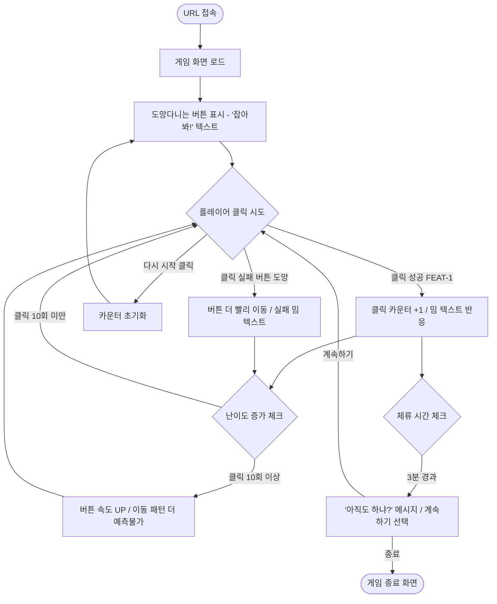
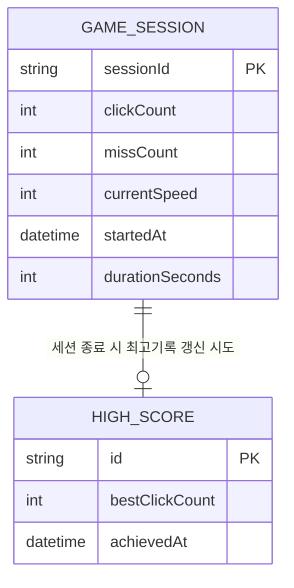

# 클릭지옥 — AI 코딩 파트너용 기획 문서 모음

> 일반 모범사례 기반으로 작성된 문서입니다 (별도 젬스 문서 미제공).
> 모든 문서는 SSOT(Single Source of Truth) 원칙에 따라 FEAT ID로 연결됩니다.

---

## 🧊 MVP 캡슐 (전 문서 공통 적용)

| # | 항목 | 내용 |
|---|------|------|
| 1 | **목표** | URL 하나로 즉시 플레이 가능한 웹 클릭 게임 출시 |
| 2 | **페르소나** | 자투리 시간에 스트레스 풀고 싶은 직장인·학생 (20~30대) |
| 3 | **핵심 기능** | FEAT-1 — 도망다니는 버튼을 클릭하는 게임 |
| 4 | **노스스타 지표** | 평균 세션 체류 시간 **3분 이상** |
| 5 | **입력 지표** | ① 클릭 시도 횟수 ② 연속 플레이 횟수 |
| 6 | **비기능 요구** | PC + 모바일 반응형, 로그인 없이 즉시 플레이 |
| 7 | **Out-of-scope** | SNS 공유, 서버 저장, 멀티플레이, 광고/수익 |
| 8 | **Top 리스크** | 버튼이 너무 빠르면 짜증만 나고 이탈 (게임이 아닌 고문이 됨) |
| 9 | **완화 실험** | 초반 3초 느리게 시작 → 점진적 가속 → 짜증 임계점 측정 |
| 10 | **다음 단계** | FEAT-1 프로토타입 제작 후 친구 3명에게 "짜증 지수(10점)" 테스트 |

---

# 📄 문서 1: PRD (제품 요구사항 정의서)

## 1-1. 문제 정의

심심한 직장인과 학생은 자투리 시간(점심, 이동, 쉬는 시간)에 가볍게 스트레스를 풀 수 있는 수단이 없습니다. 기존 모바일 게임은 설치가 필요하거나, 시작부터 너무 어려워 바로 포기하게 됩니다. 클릭지옥은 URL 하나만 있으면 설치 없이 3분 안에 짜증과 쾌감을 동시에 경험할 수 있는 웹 클릭 게임입니다.

## 1-2. 해결 가설

> "도망다니는 버튼이라는 단 하나의 메커니즘으로, 플레이어가 평균 3분 이상 머물고 '짜증 지수 7점 이상'을 기록한다면, 클릭 자체가 게임의 핵심 재미가 됨을 증명한다."

## 1-3. 목표

- 바이브 코딩 첫 번째 완성 프로젝트로서 실행 가능한 게임을 출시한다.
- 짜증과 쾌감의 감정 루프를 구현하여 체류 시간 3분을 달성한다.
- 서버 없이 브라우저만으로 완전히 동작하는 게임을 만든다.

## 1-4. 사용자 페르소나

**이름:** 박소현 (27세, 직장인)
**상황:** 점심을 먹고 자리에 돌아왔는데 15분이 남았다. 유튜브는 너무 길고, SNS는 질렸다. 뭔가 잠깐 집중해서 스트레스를 풀고 싶다.
**목표:** 아무 생각 없이 5분 이내로 끝낼 수 있는 가벼운 자극
**불편함:** 설치하기 귀찮다. 시작하자마자 튜토리얼이 나오면 이미 닫는다. 너무 어려우면 불쾌하다.
**환경:** 회사 PC 크롬 브라우저 또는 점심 식사 중 스마트폰

## 1-5. 사용자 스토리

| ID | 스토리 |
|----|--------|
| FEAT-0 | 소현으로서, URL을 열면 **즉시 게임이 시작**되어 튜토리얼 없이도 규칙을 직관적으로 이해하고 싶다. |
| FEAT-1 | 소현으로서, **도망다니는 버튼을 클릭**하면서 짜증과 성공의 감정을 반복 경험하고 싶다. |
| FEAT-2 | 소현으로서, **클릭할수록 버튼이 더 예측 불가하게** 움직여서 갈수록 도전감이 높아지길 원한다. *(v2)* |
| FEAT-3 | 소현으로서, **내 최고 기록이 저장**되어 다음에 다시 와서 갱신하고 싶다. *(v2)* |

## 1-6. 성공 지표

| 구분 | 지표 | 목표값 |
|------|------|--------|
| 노스스타 | 평균 세션 체류 시간 | **3분 이상** |
| 입력 지표 1 | 세션당 클릭 시도 횟수 | 30회 이상 |
| 입력 지표 2 | 재플레이(다시 시작) 비율 | 1세션 내 2회 이상 |
| 검증 지표 | 짜증 지수 (0~10 자가 측정) | **7점 이상** |

## 1-7. MVP 범위

### ✅ MVP에 포함 (FEAT-1)
- 도망다니는 버튼 (이동 + 점진적 가속)
- 클릭 성공 시 짜증나는 한국어 밈 텍스트 반응
- 현재 세션 클릭 횟수 카운터
- 다시 시작 버튼
- PC + 모바일 반응형

### 🔜 v2로 보류 (Out-of-scope)
- FEAT-2: 순간이동 버튼
- FEAT-3: 로컬 최고기록 저장
- 광고, 수익, SNS 공유, 서버, 멀티플레이

## 1-8. 가정과 리스크 (Top 5)

| # | 가정 | 리스크 | 완화 | 트리거 | 대응 |
|---|------|--------|------|--------|------|
| R-1 | "짜증 = 재미"라는 공식이 통한다 | 너무 짜증나면 이탈만 발생 | 초반 3초 느린 속도로 시작 | 짜증 지수 7 미만 | 버튼 속도 20% 감소 |
| R-2 | 모바일 터치로도 클릭 가능 | 작은 버튼 = 터치 불가 | 모바일 버튼 최소 크기 48px | 터치 실패율 30% 초과 | 버튼 크기 1.5배 확대 |
| R-3 | 튜토리얼 없이도 규칙 이해 가능 | 첫 화면에서 무엇을 해야할지 몰라 이탈 | 버튼에 "클릭해봐!" 텍스트 | 5초내 클릭 시도 없음 | 버튼 강조 애니메이션 추가 |
| R-4 | 로컬 저장으로 충분하다 | 브라우저 캐시 삭제 시 기록 소멸 | 기록 삭제 가능성 안내 문구 | 사용자 불만 발생 | v2에서 서버 저장 검토 |
| R-5 | 바이브 코딩으로 완성 가능하다 | 범위 확장으로 완성 못 함 | MVP 기능 외 추가 금지 | 개발 1주 초과 | FEAT-2/3 v2로 강제 이동 |

## 1-9. 실험 → 학습 루프

```
실험: FEAT-1 프로토타입 배포
  ↓
관측: 친구 3명의 짜증 지수 + 체류 시간 측정
  ↓
학습: 짜증 지수 7 이상 + 3분 체류 달성 여부 확인
  ↓
다음 가설: "순간이동(FEAT-2)을 추가하면 짜증 지수가 8 이상으로 올라간다"
```

---

# ⚙️ 문서 2: TRD (기술 요구사항 정의서)

## 2-1. 시스템 아키텍처 (고수준)

```
[사용자 브라우저]
      │
      │  URL 접속 (설치 없음)
      ▼
┌─────────────────────────┐
│   index.html            │  ← 진입점, 게임 UI 구조
│   style.css             │  ← 반응형 스타일, 카오스 애니메이션
│   game.js               │  ← 게임 로직 (버튼 이동, 클릭 감지)
│   storage.js            │  ← LocalStorage 최고기록 관리 (FEAT-3/v2용)
└─────────────────────────┘
      │
      │  데이터 저장
      ▼
[브라우저 LocalStorage]    ← 서버 없음, 해당 기기·브라우저에만 저장
```

**선택 이유:** 서버·백엔드 없이 HTML+CSS+JavaScript 3개 파일로 완성 가능. 바이브 코딩 입문자에게 가장 적합한 최소 구성.

## 2-2. 권장 기술 스택

| 영역 | 기술 | 이유 |
|------|------|------|
| 마크업 | HTML5 | 표준, 설치 불필요 |
| 스타일 | CSS3 (Vanilla) | 애니메이션·반응형 모두 가능, 의존성 없음 |
| 로직 | JavaScript (ES6+) | 브라우저 기본 내장, 프레임워크 불필요 |
| 저장 | LocalStorage API | 서버 없이 브라우저 내 데이터 저장 |
| 배포 | GitHub Pages / Netlify | 무료, URL 하나로 공유 가능 |

> ⚠️ **벤더 락인 주의:** 프레임워크(React, Vue 등) 미사용. 순수 JS로 특정 벤더 의존성 없음.

## 2-3. 비기능 요구사항

| 분류 | 요구사항 | 기준 |
|------|---------|------|
| 성능 | 첫 로딩 시간 | 3초 이내 |
| 성능 | 버튼 이동 프레임률 | 60fps 유지 (requestAnimationFrame 사용) |
| 반응형 | 모바일 터치 지원 | 최소 버튼 크기 48×48px |
| 반응형 | 화면 해상도 | 320px ~ 1920px 전 구간 정상 동작 |
| 접근성 | 색상 대비 | WCAG AA 기준 (4.5:1 이상) |
| 보안 | 외부 데이터 전송 없음 | LocalStorage만 사용, 개인정보 미수집 |

## 2-4. 핵심 기술 명세

### FEAT-1: 움직이는 버튼
- 버튼 위치: CSS `position: absolute`, `top`/`left` 값을 JS로 동적 변경
- 이동 방식: `requestAnimationFrame` 루프로 매 프레임 위치 업데이트
- 속도 증가: 클릭 성공 횟수에 따라 이동 속도 계수(multiplier) 점진적 증가
- 경계 처리: 화면 밖으로 나가지 않도록 뷰포트 크기 기준 경계값 설정
- 이벤트: `click` (PC) + `touchstart` (모바일) 동시 처리

### FEAT-0: 온보딩 없는 즉시 시작
- 페이지 로드 즉시 게임 상태(PLAYING) 시작
- 버튼에 "잡아봐!" 텍스트 초기 표시

## 2-5. 데이터 생명주기

| 데이터 | 수집 | 보존 | 삭제 | 비고 |
|--------|------|------|------|------|
| 클릭 횟수 (현재 세션) | 게임 중 | 세션 동안만 | 페이지 새로고침 시 | 서버 전송 없음 |
| 최고 기록 (FEAT-3/v2) | 게임 종료 시 | LocalStorage 영구 | 브라우저 캐시 삭제 시 | v2 구현 예정 |
| 개인정보 | **수집 안 함** | — | — | 최소 수집 원칙 |

## 2-6. 외부 API 연동

없음. 모든 기능은 브라우저 내장 API만 사용.

---

# 🗺️ 문서 3: User Flow (사용자 흐름도)



---

# 🗄️ 문서 4: Database Design (데이터베이스 설계)

> MVP는 서버 DB가 없으므로, **브라우저 LocalStorage 구조**를 ERD 형식으로 표현합니다.



**LocalStorage 키 구조:**
```
Key: "clickjigok_best"
Value: { "bestClickCount": 42, "achievedAt": "2026-03-03T23:47:00" }
```

> ⚠️ **최소 수집 원칙:** 사용자 식별 정보(이름, 기기 ID, IP 등) 일절 저장 안 함.

---

# 🎨 문서 5: Design System (기초 디자인 시스템)

## 5-1. 디자인 철학

> **"카오스하되, 읽을 수 있어야 한다."**
> 버튼은 도망가지만 UI는 명확해야 한다. 짜증은 게임 메커니즘에서, 카오스는 비주얼에서.

## 5-2. 컬러 팔레트

| 역할 | 이름 | HEX | 사용처 |
|------|------|-----|--------|
| Primary | 지옥 빨강 | `#FF3B30` | 버튼, 강조 요소 |
| Secondary | 경고 노랑 | `#FFD60A` | 밈 텍스트, 카운터 |
| Surface | 어둠 | `#0D0D0D` | 배경 |
| Surface-2 | 짙은 회색 | `#1A1A1A` | 카드, 패널 |
| Chaos-1 | 형광 초록 | `#39FF14` | 성공 피드백 |
| Chaos-2 | 보라 | `#BF5FFF` | 실패 피드백 |
| Text-primary | 흰색 | `#FFFFFF` | 본문 |
| Text-muted | 회색 | `#8E8E93` | 보조 설명 |

## 5-3. 타이포그래피

| 역할 | 폰트 | 사이즈 | 굵기 |
|------|------|--------|------|
| 게임 타이틀 | Noto Sans KR | 32px | 900 |
| 밈 텍스트 | Noto Sans KR | 20px | 700 |
| 카운터 숫자 | Courier New | 48px | 700 |
| 버튼 라벨 | Noto Sans KR | 16px | 600 |
| 안내 문구 | Noto Sans KR | 14px | 400 |

## 5-4. 간격 토큰

| 토큰 | 값 |
|------|----|
| --space-xs | 4px |
| --space-sm | 8px |
| --space-md | 16px |
| --space-lg | 24px |
| --space-xl | 48px |

## 5-5. 핵심 컴포넌트

### 도망버튼 (FEAT-1 핵심)
| 상태 | 스타일 |
|------|--------|
| 기본 | 빨간 배경, 흰 텍스트, 둥근 모서리(24px), glow 그림자 |
| 호버 | scale 1.05, 빠르게 도망 |
| 클릭 성공 | 0.1초 초록 flicker 후 새 위치 이동 |
| 도망 중 | trail 잔상 효과 |

### 밈 텍스트 (상황별)
| 상태 | 예시 텍스트 |
|------|------------|
| 게임 시작 | "잡아봐! 😈" |
| 클릭 성공 | "오 잡았네?" / "실화?" / "이게 돼?" |
| 클릭 실패 | "ㅋㅋ 못 잡지~" / "느려~" / "혹시 잠 덜 깼어요?" |
| 3분 경과 | "아직도 하냐? 일 안 해?" |
| 속도 증가 | "이제부터 진짜야 😈" |

## 5-6. 접근성 체크리스트

- [ ] 버튼 색상 대비 4.5:1 이상
- [ ] 버튼 최소 터치 크기 48×48px (모바일)
- [ ] 포커스 링 표시
- [ ] 밈 텍스트 aria-live 영역
- [ ] 과도한 깜빡임 방지 (1초 3회 미만)

---

# 📋 문서 6: TASKS (AI 개발 파트너용 프롬프트 설계서)

## 🏁 마일스톤 0: 프로젝트 뼈대

- [ ] **TASK-0-1: 프로젝트 파일 생성**
  > "index.html, style.css, game.js, storage.js 빈 파일을 만들어줘. index.html은 style.css와 game.js를 연결하는 기본 HTML5 보일러플레이트로 작성하고, 페이지 타이틀은 '클릭지옥'이야."
  - **인수 조건:** 브라우저로 열면 빈 검은 배경이 보인다. 콘솔 오류 없음.

- [ ] **TASK-0-2: Design System CSS 변수 적용**
  > "style.css 최상단에 CSS :root 변수를 선언해줘. Design System 문서 5-2의 컬러 팔레트와 5-4의 간격 토큰을 모두 변수로 등록해. 배경색을 --color-surface로 설정해줘."
  - **인수 조건:** 배경이 거의 검은색으로 보인다.

## 🏁 마일스톤 1: FEAT-0 — 즉시 시작 화면

**사용자 스토리:** "소현으로서, URL을 열면 즉시 클릭할 버튼이 보여서 규칙을 직관적으로 이해하고 싶다."

- [ ] **TASK-1-1: 게임 기본 레이아웃**
  > "index.html에 게임 영역을 만들어줘. 상단에 '클릭지옥' 타이틀, 클릭 성공 횟수 카운터(id='click-counter'), 게임 메인 영역(id='game-area'), 밈 텍스트 영역(id='mim-text'), '다시 시작' 버튼(id='restart-btn')을 배치해줘. Design System 5-3 타이포그래피를 적용해줘."
  - **인수 조건:** 모든 요소 보임. 320px~1920px 잘린 요소 없음.

- [ ] **TASK-1-2: 도망버튼 초기 배치**
  > "game-area 안에 position:absolute 빨간 버튼(id='escape-btn')을 만들어줘. 초기 텍스트는 '잡아봐! 😈', 크기는 최소 100×48px (모바일 48×48px 보장). Design System 5-5 기본 상태 스타일 적용."
  - **인수 조건:** 버튼이 화면 중앙에 빨간색으로 보임. 모바일에서 탭 가능한 크기.

## 🏁 마일스톤 2: FEAT-1 — 도망다니는 버튼 핵심 로직

**사용자 스토리:** "소현으로서, 버튼이 계속 도망다녀서 클릭하기 어렵고, 성공하면 짜릿한 느낌을 받고 싶다."

- [ ] **TASK-2-1: 버튼 이동 로직**
  > "game.js에 버튼을 움직이는 함수를 만들어줘. requestAnimationFrame을 사용해서 버튼이 game-area 안에서 계속 움직이게 해줘. 초기 속도는 느리게(1~2px/frame), 이동 방향은 랜덤이고, game-area 벽에 부딪히면 방향을 바꿔. 버튼이 화면 밖으로 절대 나가지 않게 해줘."
  - **인수 조건:** 버튼이 화면 안에서 계속 움직임. 60fps 유지 확인.

- [ ] **TASK-2-2: 클릭 감지 및 카운터**
  > "버튼에 click 이벤트를 추가해줘. 성공 클릭 시 click-counter 숫자 +1, 버튼이 새 랜덤 위치로 이동, mim-text에 성공 밈 텍스트 랜덤 표시. 성공 텍스트: ['오 잡았네?', '실화?', '이게 돼?', '어떻게 잡은 거야']. 숫자 갱신 시 0.2초 bounce 애니메이션. 모바일 touchstart도 처리."
  - **인수 조건:** 클릭 시 카운터 올라감. 밈 텍스트 바뀜. 모바일 동작 확인.

- [ ] **TASK-2-3: 점진적 난이도 증가**
  > "클릭 성공 횟수에 따라 버튼 이동 속도를 높여줘. 0~9회: 기본 속도, 10~19회: 1.5배, 20~29회: 2배, 30회 이상: 3배. 속도 증가 시 mim-text에 '이제부터 진짜야 😈' 를 0.5초 표시. 배경에 0.5초 화면 진동(shake) 애니메이션 추가."
  - **인수 조건:** 클릭 횟수 쌓일수록 버튼이 명확히 빨라짐.

- [ ] **TASK-2-4: 실패 피드백**
  > "game-area를 클릭했는데 버튼을 못 맞힌 경우, mim-text에 실패 밈 텍스트를 표시해줘. 실패 텍스트: ['ㅋㅋ 못 잡지~', '느려~', '혹시 잠 덜 깼어요?', '어림도 없지']."
  - **인수 조건:** 빈 곳 클릭 시 실패 메시지 표시.

- [ ] **TASK-2-5: 다시 시작**
  > "restart-btn 클릭 시 click-counter 0 초기화, 버튼 속도 초기화, 버튼 화면 중앙 이동, mim-text '잡아봐! 😈' 초기화."
  - **인수 조건:** 다시 시작 클릭 시 게임이 완전히 초기 상태로 리셋됨.

## 🏁 마일스톤 3: 3분 체류 루프 + 카오스 비주얼

- [ ] **TASK-3-1: 3분 경과 메시지**
  > "게임 시작 후 180초 경과 시 mim-text에 '아직도 하냐? 일 안 해? 😂' 메시지를 10초 표시. 게임은 멈추지 않고 계속 진행."
  - **인수 조건:** 3분 후 메시지 뜨고 게임 계속됨.

- [ ] **TASK-3-2: 카오스 배경 효과**
  > "배경에 매우 느린 hue-rotate 애니메이션(60초 주기, 어둡게 유지). 클릭 성공 시 0.1초 화면 flash(흰색 반투명 오버레이). Design System 5-6 참고."
  - **인수 조건:** 배경이 살아있는 느낌. 클릭 성공 시 번쩍임. 눈 피로 없음(5-7 접근성 체크).

## 🏁 마일스톤 4: 마감 및 배포

- [ ] **TASK-4-1: 메타태그 SEO**
  > "index.html head에 og:title='클릭지옥', og:description='클릭하기 어려운 버튼을 잡아라! 3분이면 중독된다.', viewport 메타태그 추가. favicon은 🔴 이모지로."

- [ ] **TASK-4-2: 최종 테스트 체크리스트**
  > "다음 항목을 테스트하고 결과 보고: ① PC 크롬에서 버튼 움직임 ② 모바일(375px)에서 버튼 탭 ③ 10회 이상 클릭 시 속도 증가 ④ 다시 시작 완전 초기화 ⑤ 콘솔 오류 없음"

- [ ] **TASK-4-3: GitHub Pages 배포**
  > "이 프로젝트를 GitHub Pages로 배포하는 방법을 단계별로 설명해줘. GitHub 계정이 있고 이 파일들을 새 레포지토리에 올릴 예정이야."

---

# 🤝 문서 7: Coding Convention & AI Collaboration Guide

## 7-1. 핵심 원칙

> **"신뢰하되, 반드시 검증하라."**
> AI가 코드를 작성해도 **최종 책임은 나(만든 사람)에게** 있습니다.
> 브라우저에서 직접 실행하고 눈으로 확인하세요.

## 7-2. 프로젝트 파일 구조

```
clickjigok/
├── index.html      ← 진입점, 구조
├── style.css       ← 스타일, 애니메이션
├── game.js         ← 게임 로직
├── storage.js      ← LocalStorage 기록 (v2)
└── README.md       ← 프로젝트 설명
```

**버전 관리:** 매 마일스톤 완료 후 커밋.
```bash
git commit -m "feat: FEAT-1 도망버튼 이동 로직 추가"
git commit -m "fix: 모바일 터치 이벤트 누락 수정"
```

## 7-3. AI와 협업하는 방법

**하나의 채팅 = 하나의 태스크**
- TASK-2-1과 TASK-2-2를 동시에 요청하지 마세요.
- 항상 컨텍스트를 제공하세요:

```
좋은 예: "현재 game.js에 moveButton() 함수가 있어.
          이 함수에 클릭 감지를 추가해줘."
나쁜 예: "클릭 되게 해줘."
```

**기존 코드 재사용:**
```
"현재 game.js 전체 내용이야: [붙여넣기]
 이 코드를 수정해서 난이도 증가를 추가해줘."
```

## 7-4. 아키텍처 원칙

1. **뼈대 먼저:** 버튼이 움직이기 전에, 버튼이 화면에 보이는지 확인
2. **작은 모듈:** 하나의 함수는 하나의 일만
   - `moveButton()` — 버튼 이동만
   - `handleClick()` — 클릭 처리만
   - `updateMimText()` — 밈 텍스트만
3. **게임 상태 객체로 관리:**
   ```javascript
   const gameState = {
     clickCount: 0,
     currentSpeed: 1,
     isPlaying: false
   };
   ```

## 7-5. 보안 체크리스트

- [ ] API 키, 비밀번호를 코드에 직접 쓰지 않는다
- [ ] 사용자 입력값을 HTML에 직접 삽입하지 않는다 (textContent 사용)
- [ ] LocalStorage 저장 전 숫자 타입 검증 (parseInt() 사용)

## 7-6. 테스트 및 디버깅 워크플로우

```
코드 작성
    ↓
브라우저에서 즉시 열기
    ↓
F12 → 콘솔 탭 → 빨간 에러 없는지 확인
    ↓
에러 시: 에러 메시지 전체를 AI에게 붙여넣기
    ↓
수정 → 재테스트
```

**오류 공유 규칙:**
```
나쁜 예: "오류 나요"
좋은 예: "콘솔에 이 에러 나요:
          'Uncaught TypeError: Cannot read properties of null'
          game.js 23번째 줄이에요."
```

## 7-7. MVP 완료 체크리스트

- [ ] index.html 브라우저에서 열린다
- [ ] 버튼이 화면 안에서 계속 움직인다
- [ ] 버튼 클릭 시 카운터가 올라간다
- [ ] 10회 이상 클릭 시 버튼이 빨라진다
- [ ] 밈 텍스트가 상황에 맞게 바뀐다
- [ ] 다시 시작 버튼이 완전히 초기화한다
- [ ] 모바일에서도 동작한다 (375px 기준)
- [ ] 콘솔 오류 없음

---

## 📊 Decision Log 전체

| ID | 항목 | 선택 | 근거 | 영향 |
|----|------|------|------|------|
| D-01 | 프로젝트명 | 클릭지옥 | 사용자 선택 | 전 문서 명칭 통일 |
| D-02 | 한줄요약 | 클릭하기 어려운 클릭을 끝없이 해야 하는 게임 | 사용자 정의 | 핵심 게임플레이 확정 |
| D-03 | 제작 동기 | 바이브 코딩 연습 | 학습 목적 | MVP 작게 유지 |
| D-04 | 핵심 경험 | 짜증과 쾌감의 반복 | 감정 루프 = 핵심 재미 | 난이도·피드백 설계 핵심 |
| D-05 | 페르소나 | 자투리 시간 직장인·학생 | 대중적 타깃 | 진입장벽 낮아야 함 |
| D-06 | 사용 환경 | 웹 브라우저 PC+모바일 | 설치 없이 URL 공유 | 반응형 필수 |
| D-07 | FEAT-1 | 움직이는 버튼 | 게임 성립 최소 조건 | 핵심 로직 |
| D-08 | FEAT-2 | 순간이동 버튼 | 예측불가성 극대화 | **v2 보류** |
| D-09 | FEAT-3 | 점수 기록 | 재도전 욕구 | **v2 보류** |
| D-10 | MVP 핵심기능 | FEAT-1 | 최소 작동 조건 | 개발 집중점 |
| D-11 | 회피 요소 | 시작부터 고난이도 | 이탈 방지 | 점진적 난이도 설계 |
| D-12 | UI 분위기 | 카오스·밈 감성 | 게임명과 일치 | 디자인 시스템 방향 |
| D-13 | 플랫폼 | PC+모바일 동등 | 접근성 최대화 | 터치·마우스 동시 처리 |
| D-14 | 외부 연동 | 없음 | 진입 마찰 최소화 | 서버·인증 불필요 |
| D-15 | 데이터 저장 | LocalStorage | 서버 없이 기록 유지 | 기기 바꾸면 소멸 |
| D-16 | 궁극적 가치 | 잠깐의 해방감 | 스트레스 해소 | 유머러스한 톤 |
| D-17 | 톤앤매너 | 한국어 밈·유머 | 게임 정체성 일치 | 전 텍스트 통일 |
| D-18 | 성공 지표 | 세션 3분 이상 | 중독성 검증 | 노스스타 KPI |
| D-19 | 수익모델 | 없음 | 연습·포트폴리오용 | 광고·결제 불필요 |
| D-20 | 검증 지표 | 짜증 지수 (0~10) | 핵심 경험 직접 측정 | "짜증 몇 점?" 테스트 |
